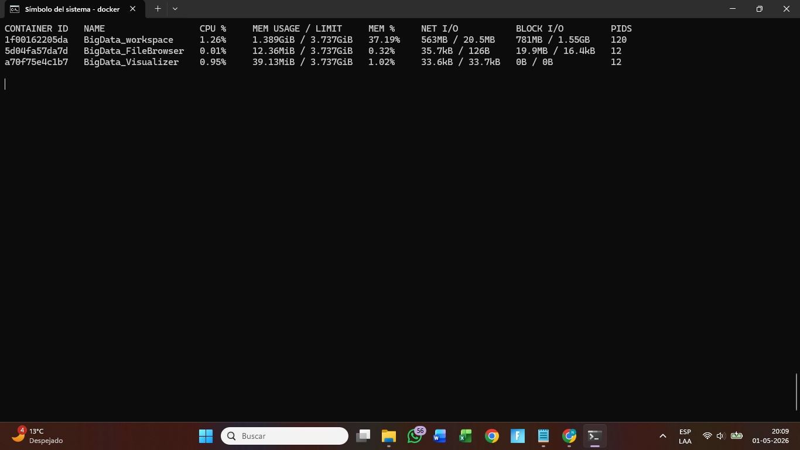
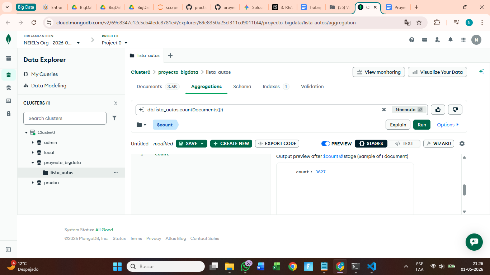

# 🚗 AutoTec — Análisis del Mercado Automotriz Chileno

**Proyecto final · Big Data para la Toma de Decisiones · IICG 2026**

AutoTec es un proyecto de análisis de datos centrado en el mercado de vehículos usados en Chile. El objetivo es comprender el comportamiento de los precios, detectar patrones relevantes en la oferta disponible y construir modelos que ayuden a estimar el valor de un automóvil según sus características, con énfasis en la depreciación asociada al kilometraje y la antigüedad.[file:2]

A partir del repositorio se desarrolla un flujo completo que incluye extracción de datos, limpieza distribuida, análisis exploratorio, generación de variables derivadas y preparación de insumos para etapas posteriores de segmentación y modelamiento predictivo.[file:2]

## Integrantes

| Nombre | Rol |
|---|---|
| Neiel Cortes | Coordinación |
| Belen Andrades | Integrante |
| Luz Azocar | Integrante |
| Daniela Cofre | Integrante |
| Jocelyn León | Integrante |
| Javiera Pizarro | Integrante |
| Martin Rojas | Integrante |

## Descripción del proyecto

El proyecto reúne publicaciones de autos usados obtenidas desde portales web del mercado chileno para analizarlas en un entorno reproducible basado en Python, Docker, Jupyter, MongoDB Atlas y PySpark.[file:2]

En el notebook de EDA multivariado se indica que el análisis considera variables originales como marca, modelo, precio, kilometraje, año, combustible y ciudad, además de variables derivadas como antigüedad del vehículo, uso anual estimado, categoría de precio, rango de kilometraje, tipo de marca, condición ecológica y un segmento de depreciación creado para profundizar el análisis.[file:2]

## Fuentes de datos

Los datos fueron recolectados mediante web scraping desde portales de compra y venta de vehículos usados en Chile, entre ellos:

- Callegari Automotriz
- Valentini
- Autocosmos
- Clicar
- Emol Automóviles
- Cariautos
- Brunofritsch
- Aspillaga Hornauer
- Difor
- Gildemeister Usados
- Autoselect
- Salazar Israel

> Nota: esta lista proviene de la descripción del proyecto entregada para el README. El notebook verificado utilizado en este repositorio trabaja sobre la colección consolidada ya limpia en MongoDB Atlas.[file:2]

## Base de datos

El notebook verificado carga datos desde **MongoDB Atlas** usando la colección **`ContenedorAutosLimpio`**, que corresponde al contenedor consolidado para el análisis multivariado.[file:2]

Según la descripción del flujo del proyecto, el proceso contempla tres etapas:

1. **Extracción**: almacenamiento inicial de datos crudos en una colección de trabajo.
2. **Limpieza**: normalización y depuración de variables con PySpark.
3. **Integración**: consolidación en `ContenedorAutosLimpio` y creación de nuevas variables analíticas.[file:2]

## Variables principales

| Variable | Descripción |
|---|---|
| `marca` | Marca del vehículo |
| `modelo` | Modelo del vehículo |
| `precio` | Precio de venta en pesos chilenos |
| `kilometraje` | Kilometraje informado en la publicación |
| `year` | Año de fabricación |
| `combustible` | Tipo de combustible |
| `ciudad` | Ciudad o comuna de publicación |

### Variables derivadas usadas en el análisis

- `antiguedadauto`
- `usoanualestimado`
- `categoriaprecio`
- `rangokilometraje`
- `tipomarca`
- `esecologico`
- `catcombustible`
- `segmentodepreciacion`[file:2]

## Tecnologías utilizadas

- **Python** para scraping, limpieza, análisis y modelamiento.
- **Selenium** y **undetected-chromedriver** para sitios dinámicos.
- **BeautifulSoup** y **Requests** para scraping estático.
- **MongoDB Atlas** como almacenamiento NoSQL en la nube.[file:2]
- **PySpark** para procesamiento distribuido y limpieza.[file:2]
- **Pandas** y **NumPy** para análisis de datos.[file:2]
- **Matplotlib** y **Seaborn** para visualización.[file:2]
- **Scikit-learn** para modelos de machine learning.
- **Docker** y **Jupyter Lab** para entorno reproducible.
- **Git** y **GitHub** para versionado y trabajo colaborativo.

## Hallazgos del EDA

En el notebook validado se trabajan **1.988 registros** provenientes de la colección consolidada para EDA multivariado.[file:2]

Las estadísticas descriptivas muestran un **precio promedio** de **16.450.599 CLP**, un **kilometraje promedio** de **71.070 km**, un **año promedio** de **2021** y una **antigüedad promedio** de **5 años**.[file:2]

La matriz de correlación del notebook muestra que `precio` tiene relación negativa con `kilometraje` 
\(-0.23\) y con `antiguedadauto` \(-0.24\), mientras que `kilometraje` y `antiguedadauto` presentan una relación positiva más marcada \(0.70\).[file:2]

El propio análisis del notebook concluye que la antigüedad aparece como una variable relevante para explicar el comportamiento del precio, aunque debe interpretarse en conjunto con otras características como marca, modelo, kilometraje y combustible.[file:2]

## Resultados destacados

El resumen por año incluido en el notebook muestra que los vehículos más recientes concentran menores kilometrajes promedio y, en general, precios medios más altos; por ejemplo, 2024 registra un precio promedio de **20.123.299 CLP** y 2025 de **20.202.467 CLP**, mientras años más antiguos presentan precios promedio menores y mayores kilometrajes.[file:2]

En el ranking por marca mostrado en el notebook, **Lexus**, **BMW**, **Mercedes** y **Audi** figuran entre las marcas con mayores precios promedio dentro del subconjunto filtrado presentado en el análisis.[file:2]

## Etapas del análisis

### 1. Extracción de datos
Cada integrante participó en la recopilación de información desde al menos una fuente web, extrayendo variables base del vehículo para integrarlas al flujo analítico del proyecto.

### 2. Limpieza y normalización
Con PySpark se estandarizaron formatos, se trataron nulos, se corrigieron inconsistencias y se preparó una colección consolidada para el análisis.[file:2]

### 3. Análisis exploratorio
Se desarrolló estadística descriptiva, visualizaciones y análisis de relaciones entre variables originales y derivadas para estudiar precio y depreciación.[file:2]

### 4. Clustering no supervisado
Según la descripción del proyecto, se aplicaron K-Means, PCA y DBSCAN como parte de la etapa de segmentación. Estos resultados aparecen en tu borrador, pero no están respaldados por el notebook verificado que se usó para construir este README, por lo que conviene dejarlos como parte general del proyecto y no como métricas validadas en este archivo.[file:2]

### 5. Modelos supervisados
El borrador menciona regresión lineal y modelos de clasificación con distintas métricas. Como esas cifras no aparecen en el notebook validado disponible aquí, se recomienda mantenerlas solo si existen notebooks o reportes adicionales en el repositorio que las documenten explícitamente.[file:2]

## Estructura sugerida del repositorio

```bash
AutoTec/
├── README.md
├── docker-compose.yml
├── notebooks/
│   ├── scrapers/
│   ├── limpieza/
│   ├── analisis/
│   ├── graficos/
│   ├── semana10_clustering/
│   └── semana12_modelos/
├── src/
│   ├── scraping/
│   ├── preprocessing/
│   └── modeling/
├── data/
│   └── muestras_o_diccionarios/
└── docs/
```

## Cómo ejecutar el proyecto

1. Clona el repositorio.
2. Levanta el entorno con `docker-compose up`.
3. Accede a Jupyter Lab en `http://localhost:8888`.
4. Ejecuta los notebooks en orden, desde scraping y limpieza hasta análisis, visualizaciones y modelamiento.

## Próximos ajustes recomendados

- Reemplazar la sección de estructura del repositorio por la estructura real una vez que el proyecto esté cerrado.
- Verificar en notebooks de clustering y clasificación las métricas finales antes de dejarlas fijas en el README.
- Agregar capturas de gráficos del EDA para que la portada del repositorio sea más visual.
- Incluir un bloque de instalación de dependencias si el repositorio también puede correrse sin Docker.

=======
# Big Data Proyecto AutoTec
Este respositorio sirve para el trabajo práctico de la asignatura Big Data. 
## Hito 1
### 1. Situación Problema
Las organizaciones del sector automotriz incluyendo concesionarias y plataformas de compraventa enfrentan serias limitaciones al definir precios de compra, venta y tasación de vehículos usados. Con frecuencia, estas decisiones se toman con información insuficiente, recurriendo a métodos manuales, criterios subjetivos o datos desactualizados.
En muchos casos, el valor de un vehículo se determina de manera práctica, basándose en la experiencia del vendedor o en promedios generales de mercado. Este enfoque no incorpora de forma precisa variables críticas como el kilometraje, el estado de conservación o la ubicación, lo que afecta directamente la exactitud de la tasación.
Asimismo, el uso de tablas de depreciación estáticas o referencias genéricas no refleja la dinámica real del mercado ni el impacto de factores como marca, modelo, año y por sobre todo el kilometraje del vehículo en la pérdida de valor. Como consecuencia, las organizaciones se exponen a riesgos relevantes: la sobrevaloración, que disminuye la competitividad, y la subvaloración, que afecta la rentabilidad. En definitiva, la toma de decisiones se sustenta más en la intuición que en información confiable, limitando la capacidad de competir de manera eficiente.

### 2. Propuesta de Valor
La incorporación de técnicas de scraping en plataformas de venta de automóviles usados constituye una solución innovadora, al reemplazar enfoques intuitivos por modelos sustentados en Business Intelligence (BI).
El scraping aplicado en estas páginas permite recolectar de manera automatizada grandes volúmenes de datos actuales y relevantes del mercado, conformando una base  con etiquetas clave como marca, modelo, año, kilometraje, combustible y precio.
La disponibilidad de estas etiquetas posibilita realizar comparaciones entre vehículos que comparten características similares, midiendo la diferencia de kilometraje y, a partir de ello, estimando la variación de valor. Este análisis constituye la base para calcular la depreciación real de los vehículos, reemplazando estimaciones subjetivas por métricas verificables y mejorando la exactitud en los procesos de tasación.
Además, el acceso a datos históricos y actualizados abre la puerta al desarrollo de modelos predictivos capaces de estimar el valor de un vehículo según sus características y nivel de desgaste. Esto otorga a las organizaciones una ventaja competitiva significativa, al permitir ajustar precios de compra y venta en función de las condiciones actuales del mercado.
En conclusión, el scraping no solo eleva la calidad de la información disponible, sino que la transforma en conocimiento estratégico, habilitando una toma de decisiones más informada, precisa y orientada a maximizar la rentabilidad y competitividad en el negocio automotriz.
### 3. Análisis de las 4V Iniciales:
1. Volumen: Para que el análisis sea confiable y provechoso, se necesita recolectar una numerosa cantidad de datos, idealmente más 3000 registros, considerando aproximadamente 500 datos por persona, siendo una muestra representativa para el estudio del caso. Esto es importante porque el mercado automotriz usado tiene mucha variación: un mismo modelo puede cambiar bastante de precio según el año, kilometraje, ciudad, estado, combustible o página donde fue publicado.
Si se trabaja con pocos datos, el promedio puede quedar distorsionado por casos aislados, por ejemplo, un auto demasiado barato por estar en mal estado o detalles significativos, también uno muy caro por tener poco kilometraje. Sin embargo, si se tiene más de 3000 datos, se obtiene una muestra mucho más representativa, con menos sesgo, permite que los promedios se estabilicen y reflejen mejor la distribución real del mercado.
Este volumen permite comparar marcas, modelos, años y rangos de kilometraje con mayor precisión. Así, la decisión sobre depreciación no se basa en percepciones, sino en una cantidad suficiente de datos reales publicados en distintas plataformas como Yapo, Autocosmos, Piamonte, Callegari, Kovac, Clicar, Emol, Cariautos y Bruno Fritsch. 
 2. Variedad : La variedad es fundamental porque no basta con extraer solo el precio del vehículo para poder analizar correctamente la depreciación, se necesitan varias etiquetas o variables que entreguen un mejor contexto al dato.
En el caso de Autotec, se recopilan datos como: Marca, modelo, año, kilometraje, combustible, ciudad, precio y fecha de captura. Estas variables permiten entender por qué un auto vale más o menos que otro. Por ejemplo, dos vehículos de la misma marca, modelo y año pueden tener precios distintos si uno tiene menos kilometraje, es de un año más reciente, está en otra ciudad o usa un tipo de combustible diferente.
También es importante extraer información desde distintas páginas, porque cada plataforma puede tener públicos, precios y tipos de publicaciones diferentes. Comparar datos de Yapo, Autocosmos, Clicar, Emol, concesionarias y automotoras permite tener una visión más amplia del mercado.
El atributo Fecha de Captura, permite ordenar los datos en el tiempo y asegurar una correcta comparación en intervalos de tiempo, ya que los precios en el mercado automotriz son tan volátiles, tener un registro estructurado con un atributo de fecha, se garantiza que el análisis de depreciación sea coherente y periodico. 
Gracias a esta variedad, se puede analizar no solo el precio promedio, sino también cómo influye cada característica en la depreciación del valor del auto y en específico en como el kilometraje influye de manera importante en el valor del vehículo. 
3. Veracidad : La veracidad se refiere a asegurar que los datos scrapeados sean reales, útiles y confiables. Como los datos vienen desde distintas páginas web, pueden existir errores, publicaciones incompletas, precios mal escritos, vehículos repetidos, valores fuera de lo normal o bien campos vacíos. 
Para mejorar la veracidad, es importante realizar una limpieza de datos. Por ejemplo, no todas las páginas tendrán el mismo formato de precio para ello se debe transformar todos los precios al mismo formato, eliminar símbolos como “$” o puntos, validar que el año sea lógico, revisar que el kilometraje sea numérico y descartar registros sin precio, sin modelo o con datos incompletos, asegurando un estándar de calidad y formato para la manipulación y estudio del caso. 
También se deben eliminar valores extremos que pueden alterar el promedio. Por ejemplo, si un auto aparece publicado a $1.000 o a $999.999.999, es un error o una publicación que no sirve para el análisis y puede perjudicar completamente el propósito de scraping. 
La fecha de captura es importante, porque permite ordenar los datos en el tiempo y hacer comparaciones correctas. Por ejemplo, no sería bueno comparar un precio tomado en enero con otro muchos meses después sin considerar los cambios del mercado. Tener la fecha ayuda a hacer un análisis más real y ordenado.
Además, se debe revisar si existen vehículos duplicados entre páginas o dentro de la misma plataforma. Esto permite evitar contar el mismo auto varias veces y que los resultados se vean alterados. Con estos procesos, el análisis no se basa simplemente en datos recolectados, sino en datos depurados, ordenados y confiables.
4. Velocidad : La velocidad es la relación con que la frecuencia debe ejecutarse al scraper para que la información no quede obsoleta. El objetivo principal no es ver cambios diarios de precio, sino analizar la depreciación del valor de los autos según su kilometraje. Por eso, no se necesita correr el scraper todos los días, porque el kilometraje y la baja de valor se ven mejor en un tiempo más largo. 
Para este caso, lo mejor sería ejecutar el scraper una vez al mes, ya que así se puede comparar cómo cambian los precios de autos parecidos según kilometraje, marca, modelo, año, combustible y ciudad. Al guardar datos cada mes, se puede formar una base histórica para ver si un auto con más kilometraje vale menos y cuánto baja su precio promedio frente a otros del mismo tipo. 
En conclusión, para estudiar la depreciación por kilometraje, una frecuencia mensual es suficiente, porque permite ver tendencias reales sin juntar datos repetidos. Así, el análisis se enfoca en cuánto influye el kilometraje en el precio de un auto usado.


### a) Comando para ejecutar
```bash
docker-compose up -d
```

### b) Evidencia 1: Consumo de contenedores


### c) Evidencia 2: Conteo de documentos en MongoDB


### d) Tabla de Atributos
En este hito, todos los integrantes trabajaron con una estructura de datos común.  
Cada registro almacenado en MongoDB fue construido con los mismos atributos, con el objetivo de mantener consistencia en la base de datos y facilitar el análisis posterior.

Los campos utilizados en cada documento fueron los siguientes:

- `marca`
- `modelo`
- `year`
- `kilometraje`
- `combustible`
- `ciudad`
- `url`
- `precio`
- `fecha_captura`
- `grupo`
- `usuario`

Si bien la instrucción solicita una tabla de atributos por integrante, en este proyecto no se dividieron los campos por persona.  
En cambio, cada integrante capturó aproximadamente 500 registros utilizando la misma estructura de atributos, diferenciándose principalmente por la fuente de datos utilizada.

### Tabla de integrantes y fuentes extraídas

| Integrante | Sitio(s) fuente | Observación |
|------------|-----------------|-------------|
| Daniela Cofre | [Yapo Autos Usados](https://www.yapo.cl/autos-usados/coquimbo-la-serena) | Extracción de registros desde portal de autos usados. |
| Jocelyn Leon | [Bruno Fritsch](https://www.brunofritsch.cl/autos-usados) | Extracción de autos usados con la estructura común del proyecto. |
| Luz Azocar | [Emol Autos Usados](https://automoviles.emol.com/venta/autos-usados) | Captura de vehículos usados bajo el mismo esquema JSON. |
| Javiera Pizarro | [Clicar](https://www.clicar.cl/vehiculos/usado) | Registros obtenidos manteniendo los mismos atributos. |
| Neiel Cortes | [Autocosmos](https://www.autocosmos.cl/auto/usado) | Extracción de publicaciones de autos usados. |
| Martin Rojas | [Aspillaga Hornauer](https://seminuevos.aspillagahornauer.cl/stock-seminuevos/), [Difor](https://www.difor.cl/autos-usados-chile?page=), [Piamonte Usados](https://www.piamonteusados.cl/autos/seminuevos?annio_desde=&annio_hasta=&precios=&unidades=30) | Se utilizaron varias fuentes porque una sola página no tenía suficientes vehículos para alcanzar la cantidad requerida. |
| Belen Andrades | [Callegari](https://callegari.cl/seminuevos/), [Gildemeister Usados](https://gildemeisterusados.cl/compra-tu-auto/), [Valentini Seminuevos](https://seminuevosvalentini.cl/), [Autoselect](https://www.autoselect.cl/web/autos-usados?page=%7B%7D), [Salazar Israel](https://www.salazarisrael.cl/vehiculos/usado) | Se recurrió a múltiples sitios para completar el volumen mínimo de registros exigido. |

### Estructura de cada documento almacenado

Ejemplo de documento JSON:

```json
{
  "marca": "Toyota",
  "modelo": "Hilux",
  "year": "2018",
  "kilometraje": "180 km",
  "combustible": "diesel",
  "ciudad": "Buin",
  "url": "https://...",
  "precio": 12600000,
  "fecha_captura": "2026-04-30 23:39:11",
  "grupo": "autotec",
  "usuario": "dani"
}
```
